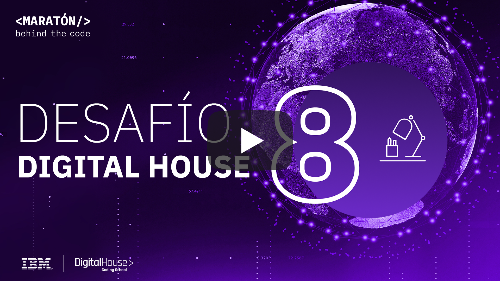
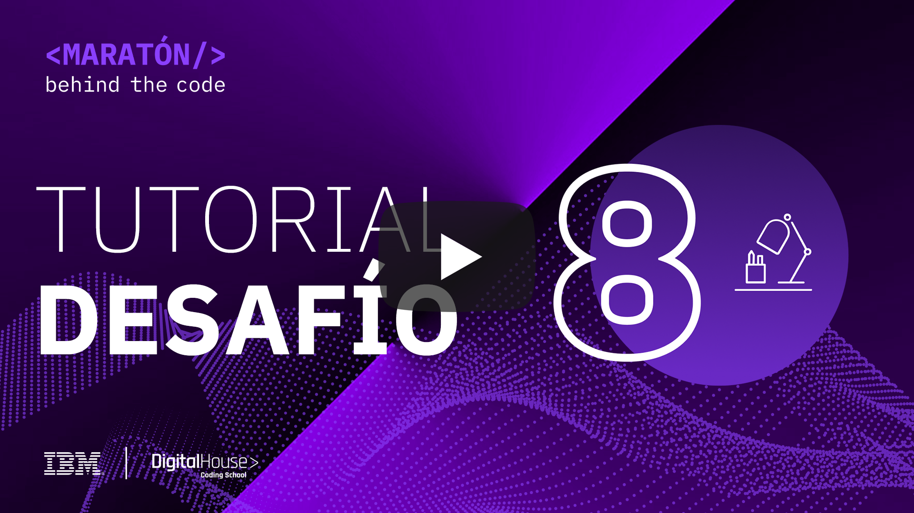
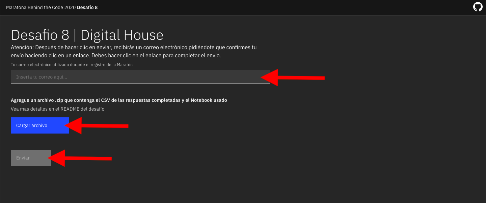

# Desafio 08 | Digital House

- [1. Acerca de Digital House](#1-acerca-de-digital-house)
  - [1.1. Becas de Digital House](#11-becas-de-digital-house)
- [2. Reto de negocio](#2-reto-de-negocio)
- [3. Objetivo](#3-objetivo)
- [4. Desarrollando la solución](#4-desarrollando-la-solución)
  - [4.1. La tecnología del reto](#41-la-tecnología-del-reto)
  - [4.2. Pre-requisitos](#42-pre-requisitos)
  - [4.3. Resumen de las tareas](#43-resumen-de-las-tareas)
  - [4.4. Desarrollo](#44-desarrollo)
- [5. Envío](#5-envío)
- [6. Sobre la evaluación](#6-sobre-la-evaluación)

## Para Ayudarte

- [Material de apoyo](#material-de-apoyo)
- [Solución de problemas](#solución-de-problemas)
- [Licencia](#licencia)

## 1. Acerca de Digital House

Digital House es una organización educativa originada en Argentina como el primer coding school de clase mundial que, a través de cursos de programación intensivos, está formando a las nuevas generaciones de profesionales digitales no solo de Argentina, sino también de Brasil, México y el resto de Latinoamerica.

La plataforma ofrece cursos diseñados para todas las personas que quieran aprender, desde ejecutivos, profesionales de distintas áreas, emprendedores, equipos de trabajo hasta estudiantes de educación básica y media superior. Son mas de 20 mil alumnos los que egresan cada año y más de 99 mil graduados forman parte de la comunidad de Digital House. Una red dinámica de relaciones y oportunidades de negocios que crece cada día más.

Bajo la consigna “Aprender no tiene límites” la propuesta educativa de Digital House está disponible siempre, para que puedas acceder estés donde estés.

    

### 1.1 Becas de Digital House
Para que sigas capacitándote y mejores tus chances de empleabilidad, Digital House dará becas de estudio a los participantes de la Maratón. Inscríbete [AQUÍ](https://www.digitalhouse.com/ar/beca/maraton?utm_source=Marat%C3%B3n&utm_medium=referral&utm_campaign=Lead&utm_term=B2C-B2B&utm_content=INSTITUCIONAL-INSTITUCIONAL-BECA-LANDINGI-BANNER-LEADS-NONE-INSTITUCIONAL-NONE-NONE-NONE-none-none-none-none-ALL-ALL-NONE-Marat%C3%B3n)!

Para aquel participante que obtenga mayor puntaje en el ranking general de su país, Digital House dará 1 beca 100% gratuita en los siguientes cursos: Programación Web Full Stack / Marketing Digital / Data Analytics / Data Science / Diseño UX - a elección del participante y según disponiblidad. (Total 8 becas full: Argentina, Colombia, Chile, Ecuador, México, Perú, Uruguay & Venezuela)

Además, entre todos los participantes que completen los 8 desafíos de la Maratón, Digital House sorteará 13 becas con 50% de descuento en los cursos antes mencionados.

Para poder acceder a estas becas inscríbete [AQUÍ](https://www.digitalhouse.com/ar/beca/maraton?utm_source=Marat%C3%B3n&utm_medium=referral&utm_campaign=Lead&utm_term=B2C-B2B&utm_content=INSTITUCIONAL-INSTITUCIONAL-BECA-LANDINGI-BANNER-LEADS-NONE-INSTITUCIONAL-NONE-NONE-NONE-none-none-none-none-ALL-ALL-NONE-Marat%C3%B3n)

## 2. Reto de negocio
El reto de Digital House tiene que ver con la misión y visión de la empresa; la cual busca transformar la vida de las personas, desarrollando competencias digitales, para que generen un impacto positivo en la sociedad.

En ese sentido, Digital House busca a través de este desafío medir la empleabilidad de los cursos que disponibiliza en su plataforma. Es decir, qué tan factible es que un alumno o egresado de Digital House acceda al mercado laboral o consiga un trabajo en su área, luego de finalizar uno o varios de los cursos ofrecidos en la plataforma.

Entender qué características o variables hacen que una persona sea más o menos empleable es fundamental para la empresa y para generar ese impacto positivo que busca aportar a la sociedad.

## 3. Objetivo
Digital House desea poder predecir cuanto se demorarán sus estudiantes en ser empleados. Para ello el participante usará data del descriptiva de los estudiantes, asi como de su desempeño en el curso de Digital House. El participante debe desarrollar un algoritmo o un modelo de Machine Learning que sea capaz de predecir cuantos dias se demorará un estudiantes en ser contratado.

En este desafío, Digital House usará herramientas de IBM como [Watson Studio (o Cloud Pack for Data)](https://cloud.ibm.com/catalog/services/watson-studio) para construir un modelo de Machine Learning.

La idea esencial del Desafío es crear un modelo basado en machine learning de regresión capaz de predecir los dias hasta que un estudiante sea contratado.

## 4. Desarrollando la solución

### 4.1. La tecnología del reto
En este desafío vamos a usar las siguiente herramienta

[Watson Studio](https://cloud.ibm.com/catalog/services/watson-studio) proporciona un conjunto de herramientas y un entorno colaborativo para científicos de datos, desarrolladores y expertos en dominios. Es un ambiente de desarrollo (IDE) web que combina herramientas Open Source con tecnología de IBM para desarrollar modelos de Machine Learning y Deep Learning.

Mira el tutorial a continuación para aprender como aplicar la tecnología de IBM para resolver el desafío

    

### 4.2. Pre-requisitos
Para poder realizar este desafío, se deben cumplir con los siguientes requisitos previos:

- Estar registradro en la [Maratón Behind the Code](https://maratona.dev/es) y confirmar el e-mail de registro.
- Tener una cuenta en [IBM Cloud](https://ibm.biz/registro-maratona), que puede ser una cuenta GRATUITA o de pago (no es necesario registrarse en el evento con el mismo correo electrónico utilizado para crear su cuenta IBM Cloud).

### 4.3. Resumen de las tareas

1. Cree el servicio [Watson Studio (Cloud Pak for Data as a Service)](https://cloud.ibm.com/catalog/services/watson-studio) en IBM Cloud. (Si ya lo creo en el desafío 2 no es necesario volverlo a crear)
2. Cree el servicio [Cloud Object Storage](https://cloud.ibm.com/catalog/services/cloud-object-storage) (Si ya lo creo en el desafío 2 no es necesario volverlo a crear)
3. [Crear un nuevo proyecto vacío en Watson Studio](https://dataplatform.cloud.ibm.com/projects/new-project?context=cpdaas)
4. Crear el token de acceso al proyecto
5. Importar el notebook usando el archivo `notebook.ipynb`
6. Leer y ejecutar las instrucciones contenidas en el Notebook `notebook.ipynb`.
7. Guarde el csv como `results.csv` con sus predicciones y el notebook que desarrolló `notebook.ipynb`.
8. Envíe su solicitud a [https://digitalhouse.maratona.dev/](https://digitalhouse.maratona.dev/)

### 4.4. Desarrollo
La idea esencial del Desafío 8 es crear un modelo basado en machine learning capaz de predecir el tiempo para que un estudiante sea empleado. El participante trabajará con un conjunto de datos sintéticos proporcionados y creará una modelo que realice la predicción y producir un archivo csv con los resultados.

**En este repositorio encuentra el notebook necesario para crear proyecto en Watson Studio, pero no es una solución lista, ni funcional.**

## 5. Envío
**Las entregas de soluciones se abren el miercoles 16 de Septiembre***

Para hacer la entrega, debes acceder a la siguiente página: https://digitalhouse.maratona.dev/ y cargar un archivo zip con el archivo csv results.csv con los resultados de su predicción y el notebook que desarrolló notebook.ipynb. El resultado debe tener 1000 filas + los headers.

**Si cambia el nombre o formato del archivo csv su solución no será evaluada**

**Si cambia el nombre del notebook su solución no será evaluada**

Después de cargar su archivo haga clic en el botón en la esquina inferior derecha para ENVIAR su solución, como se muestra en la imagen a continuación, y complete el formulario con su dirección de correo electrónico utilizada de la inscripción en MARATÓN 2020.

Enviar: 

</img>

## 6. Sobre la evaluación
En esencia, el reto puntuará la respuesta de su modelo en un archivo csv. En esta ocación se tomará en cuenta el r2, que mide el portenaje de variacíon de la respuesta. El problema que debe resolver el modelo de machine learning es un problema clásico de regresión, y se encuentran más detalles en el notebook jupyter proporcionado.

La rapidez de entrega no se incluye en el cálculo de la puntuación del desafío. Sin embargo, para todos los participantes que presenten este desafío en la primera semana después del lanzamiento, recibirán una bonificación del 10% en la puntuación final de la entrega.

Recuerde que tiene 1 oportunidade de envío de la solución del reto.

## Material de apoyo

- [Video Watson Studio](https://www.youtube.com/watch?v=BecC1U5PJT4)
- [Una guía del portal de IBM Developer para principiantes del Machine Learning](https://developer.ibm.com/es/patterns/use-icp4d-to-build-the-machine-learning-model-for-return-propensity/)
- [Watson Studio Docs](https://dataplatform.cloud.ibm.com/docs/content/?context=cpdaas)

## Solución de problemas

Mira el [video explicativo](#4-desarrollando-la-solución) provisto en la Sección 4, o si lo deseas, revisa la documentación de los servicios involucrados en este desafío.

> Si ya consumio todo su plan gratuito de Watson Studio puede crear otra cuenta de [IBM Cloud](https://ibm.biz/registro-maratona) con otro correo.

Accede al discord oficial de la Maratón 2020 para hacer preguntas y/o interactuar con otros participantes: [Discord](https://discord.gg/Q9At74C).

## Licencia

Copyright 2020 Maratona Behind the Code

Licensed under the Apache License, Version 2.0 (the "License"); you may not use this file except in compliance with the License. You may obtain a copy of the License at

   http://www.apache.org/licenses/LICENSE-2.0
Unless required by applicable law or agreed to in writing, software distributed under the License is distributed on an "AS IS" BASIS, WITHOUT WARRANTIES OR CONDITIONS OF ANY KIND, either express or implied. See the License for the specific language governing permissions and limitations under the License.
